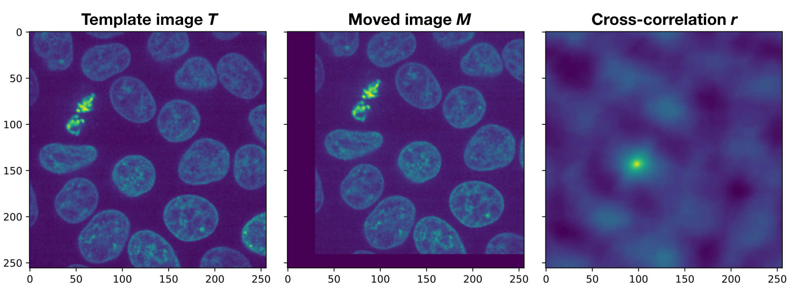
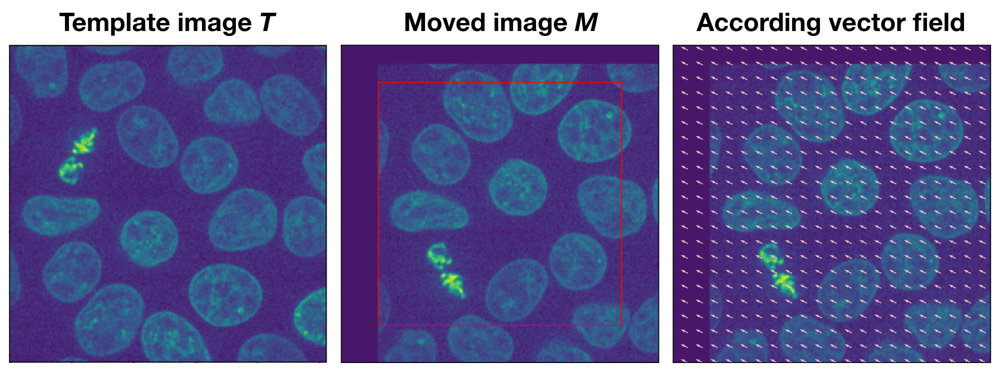
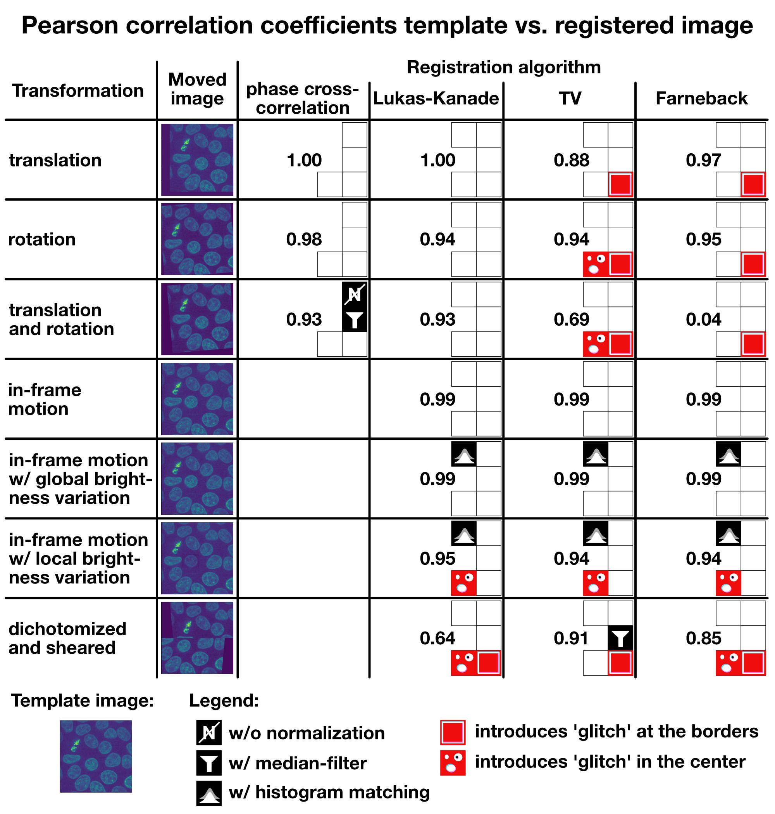

# Bio-image registration with Python

The scripts in this repository were used to evaluate the performance of common bio-image registration methods with *Python*. The results of this study are summarized in this [blog post](https://www.fabriziomusacchio.com/blog/2023-01-02-image_registration/#optical-flow-methods-1). The main evaluation routine is `imreg_tests.py`.

Demonstration of the phase correlation method:

Demonstration of an optical flow method:

Summary of our results: Pearson correlation coefficients for the template image vs. the registered image for each tested transformation and algorithm:

